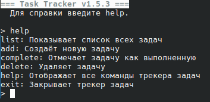

# TaskTracker


## Описание
TaskTracker - консольное приложение для управления задачами. Является небольшой программкой, написанной мной на Python для закрепления знаний языка.

## Возможности
Программа позволяет создавать и удалять задачи, а также помечать их как выполненные. Управление осуществляется через ввод команд.

## Пример использования
```sh
$ ./main.py 
=== Task Tracker v1.5.3 ===
  Для справки введите help.

> add
[Введите название задачи]> Задача 
Задача успешно добавлена.
> list 
[26.12.2025 17:41] Задача 
```
